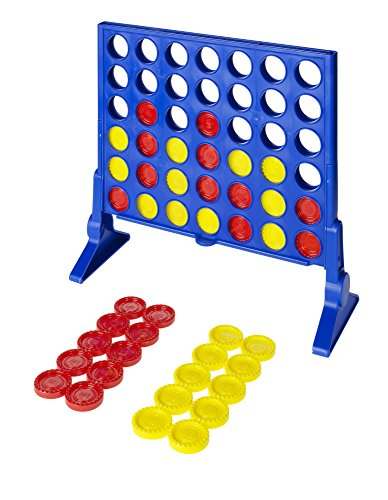

# Connect Four Project

The goal of this project is to implement [Connect Four](https://en.wikipedia.org/wiki/Connect_Four) using Ruby and [TDD (Test-Driven Development)](https://en.wikipedia.org/wiki/Test-driven_development).

Test-Driven Development follows this cycle:

1. Add a Test

2. Run all Tests -- the new Test should Fail

3. Write the Code for the Test to Pass

4. Run Tests

5. Refactor

6. Repeat

This is a project from [The Odin Project](https://www.theodinproject.com/courses/ruby-programming/lessons/testing-ruby).

[Pending Project Image...]



## Installation

Open your Terminal/Command Line. Navigate to the directory where your version will live. Type in the following:

```
$ git clone https://github.com/JonathanYiv/connect_four.git
$ cd connect_four
$ ruby lib/game.rb
```

## Pre-Project Thoughts

This will be my first project that I tackle TDD-style. 
The only thing that I think will be slightly challenging to implement will be checking for win conditions since there are so many permutations.
I somehow have to use a search function to look at all nearby nodes for an inserted 'disc', and for all nearby nodes that are of equal value, search in the same direction to see if there are four in a row.

### Project Structure

```ruby
# gameboard.rb
class GameBoard
	instance variables:
		@board: is an array of column arrays
		@player1
		@player2
		@player_turn: will be 1 or 2
	methods:
		play: displays the title, @board, and instructions
			title: displays an ASCII art title
			display: displays @board in the shape of a Connect Four game
			instructions: displays the game instructions
			turns: starts a loop that changes @player_turn value every turn and checks for win scenario
				turn: has @player1/@player2 take_turn and add_disc to @board
					add_disc: adds a value to the 'bottom' of the column array in the appropriate @board array
				check_for_win: checks for win scenarios, for every added disc, it will check all discs at distance = 1 if they are the same, if so:
							   it will check in the same direction to see if there are 4 in a row, if so, win conditions are met
			win: displays winning text

# player.rb
class Player
	instance variables:
		@name: player name
	methods:
		take_turn: gets input to pass to GameBoard.add_disc

# game.rb
# requires gameboard and player classes, asks for player names, then starts the game
```

## Post-Project Thoughts

This project is currently incomplete...