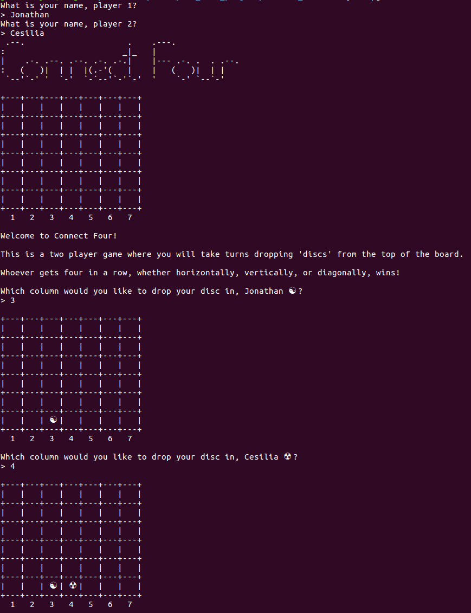

# Connect Four Project

The goal of this project is to implement [Connect Four](https://en.wikipedia.org/wiki/Connect_Four) using Ruby and [TDD (Test-Driven Development)](https://en.wikipedia.org/wiki/Test-driven_development).

Test-Driven Development follows this cycle:

1. Add a Test

2. Run all Tests -- the new Test should Fail

3. Write the Code for the Test to Pass

4. Run Tests

5. Refactor

6. Repeat

This is a project from [The Odin Project](https://www.theodinproject.com/courses/ruby-programming/lessons/testing-ruby).



## Installation

Open your Terminal/Command Line. Navigate to the directory where your version will live. Type in the following:

```
$ git clone https://github.com/JonathanYiv/connect_four.git
$ cd connect_four
$ ruby lib/game.rb
```

## Pre-Project Thoughts

This will be my first project that I tackle TDD-style. 
The only thing that I think will be slightly challenging to implement will be checking for win conditions since there are so many permutations.
I somehow have to use a search function to look at all nearby nodes for an inserted 'disc', and for all nearby nodes that are of equal value, search in the same direction to see if there are four in a row.

### Project Structure

```ruby
# gameboard.rb ✓
class GameBoard ✓
	instance variables: ✓
		@board: is an array of column arrays ✓
		@player1 ✓
		@player2 ✓
		@player_turn: will be 1 or 2 ✓
	methods: ✓
		play: displays the title, @board, and instructions 
			title: displays an ASCII art title ✓
			display: displays @board in the shape of a Connect Four game ✓
			instructions: displays the game instructions 
			turns: starts a loop that changes @player_turn value every turn and checks for win scenario
				turn: has @player1/@player2 take_turn and add_disc to @board
					add_disc: adds a value to the 'bottom' of the column array in the appropriate @board array
				check_for_win: checks for win scenarios, for every added disc, it will check all discs at distance = 1 if they are the same, if so:
							   it will check in the same direction to see if there are 4 in a row, if so, win conditions are met
			win: displays winning text

# player.rb ✓
class Player ✓
	instance variables: ✓
		@name: player name ✓
	methods: ✓
		take_turn: gets input to pass to GameBoard.add_disc 

# game.rb ✓
# requires gameboard and player classes ✓
# asks for player names ✓
# then starts the game 
```

## Post-Project Thoughts

1. As I created tests, I ran into the issue of properly testing File IO. After evaluation and feedback from the Odin Chat, it appears that you simply wouldn't test the IO. You would just test the behavior/interface and not the implementation. Now, for the purposes of this exercise, they mandated that anything I code must have a test for it, so... I will do it for the sake of practice but I understand the reality going forward. Update (Several Hours Later): I will not test IO. Testing input and output and sanitizing input is just.. ridiculously complex and annoying for the scope of this project.

2. Furthermore, @KevinMulhern helped me understand that testing particular implementation details makes the tests brittle as opposed to testing behavior.

3. This was one of the more frustrating projects because I already had the layout for the entire program made, and just needed to implement it. Changing my mindset towards making tests first was and still is inhibiting on productivity, although I can understand why it is beneficial in the long term. Since this project asked me to test every single thing meticulously, I learned that there are some things that are definitely meant to be tested or are not worth testing. I will not test those things in the future, but I will try to integrate TDD into my development workflow. Sigh.

4. After some investigation, apparently a [Psuedo-Terminal](https://ruby-doc.org/stdlib-2.2.3/libdoc/pty/rdoc/PTY.html) might have sufficed for testing IO. I feel this is too complicated for my current level.

5. There do not appear to be very many up to date resources on RSpec. Here's a brief overview with rankings from my best to worst:

	1. RubyPigeon's [Core](http://www.rubypigeon.com/posts/rspec-core-cheat-sheet/) and [Expectations](http://www.rubypigeon.com/posts/rspec-expectations-cheat-sheet/) cheat sheets are fantastic.

	2. [Semaphore's Learn RSpec](https://semaphoreci.com/community/series/learn-rspec) series is also great.

	3. The [official documentation](http://rspec.info/documentation/) and [Relish documentation](https://relishapp.com/rspec) while useful and informative, aren't really beginner friendly. 

	4. One of the maintainer's 2 hour [Screencast Course on PluralSight](https://www.pluralsight.com/courses/rspec-ruby-application-testing) is very informative, but it's not well-suited for beginners and doesn't really fill in my gaps of knowledge for HOW and WHAT to test in an easy-to-understand way. (To be fair, the course description does say that it is recommended for intermediate level programmers, so I was in over my head.)

	5. [BetterSpecs](http://www.betterspecs.org/), while informative, also appears to be outdated with the most recent substantial changes occuring about two years ago. 
	
	6. [The RSpec Book](https://pragprog.com/book/achbd/the-rspec-book) is multiple versions and seven years behind at this time. 

	7. There are minimal blog posts with information very spread out.

	8. [CodeSchool's RSpec Course](http://rspec.codeschool.com/levels/1) is.. meh. Their new one requires a subscription.

	9. There is an official up-to-date beta [Effective Testing with RSpec 3](https://pragprog.com/book/rspec3/effective-testing-with-rspec-3) book, however, it costs money and obviously, my goal is to achieve my learning without cost.

6. This project took me way too long. Methods without tests include:

	1. gameboard.rb

		1. #win

		2. #draw

		3. #check_for_win

		4. #add_disc

		5. #turn

		6. #turns

		7. #play

		8. #instructions

	2. player.rb

		1. #take_turn

	3. game.rb

		1. play_game
		
7. Looking back from further along, I realize that [TDD is dead](http://david.heinemeierhansson.com/2014/tdd-is-dead-long-live-testing.html). @benjaminapetersen and me had discussed testing previously and he had mentioned the idea of a 'spike/sprint.' You code first to get something working, then write a test if necessary, then refactor. This sounds much better than TDD. For this project, there was some cognitive dissonance when trying to get 100% test coverage, but I realize now that a dogmatic approach to testing can be a negative rather than a benefit. 
